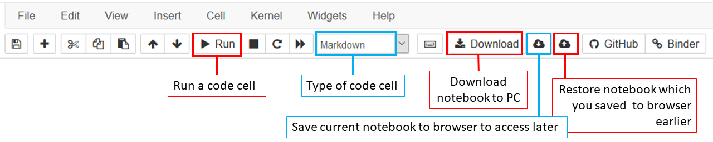

# RocSocCodeCamp 2021: Python Programming Fundamentals for Geoscientists

## Summary
This is a repository of resources for teaching basic programming skills to geoscientists in the Python programming language, which was created for the University College Dublin Geological Society (RocSoc) as part of the May 2021 'CodeCamp for Geoscientists'. The resources contained within aim to provide a brief overview of the fundamentals of geoscience data manipulation, analysis and visualisation in Python and also provide various resources for following up and expanding knowledge of the topic.

The resources are not a comprehensive guide to learning Python and this is not their intention. Computer coding ability is best gained by regular practice, and there are a huge wealth of options available for continuing coding and building upon what is covered here, as detailed in ['AdditionalResources.md'](https://github.com/wobrotson/RocSocCodeCamp/blob/main/CodeCampFurtherInfo/AdditionalResources.md).

## Programming environment
The content of this repository is a self-contained iPython coding environment, which uses [Jupyter Notebooks](https://jupyter.org/), an interactive web-based programming environment, to write and run Python code. The entire repository can be loaded and run using the Binder platform. The following link provides access to the coding environment in a browser:

https://mybinder.org/v2/gh/wobrotson/RocSocCodeCamp/HEAD

Alternatively, simply copy and paste the repository URL into the [Binder launcher](https://binder.mybinder.ovh/) to build an environment for executing the codes.

Binder requires regular action within the coding environment to maintain and save any code that you are running. You should pay attention to this to ensure you don't lose any code you write during the sessions. I recommend doing something on the page (eg typing some code or creating a new code cell) **every 10 minutes at least**. You may notice in the browser tab that a 'timer' symbol appears - this is telling you to be active in the kernel. You may encounter an error message 'dead kernel' asking you to restart the kernel - if you do this quickly enough any changes you have made will be preserved.

It is possible to 'save' your work in Binder within the browser window to return to later, and it is also possible to download everything you've done from Binder for working on locally afterwards (if you install Anaconda on your PC - see below). See the below image for a guide to how to do this with the icons in the toolbar when you are editing a notebook in Binder.

To work on the material more intermittently (eg every few hours or days) and save everything you do, it's much better to download this repository to your machine and work on it there. For those wishing to use the repository materials on their machine locally, please follow the instructions in the file ['GettingAnacondaOnMyPC.md'](https://github.com/wobrotson/RocSocCodeCamp/blob/main/CodeCampFurtherInfo/AdditionalResources.md). 

All the notebooks in this repository run on an **Anaconda3 environment** defined in `environment.yml`.
The notebooks were developed and tested on Windows 10 and Ubuntu 18.04 using Python3 (version: 3.6+).

## Content
Session 1 covers the fundamentals of Python coding in the Jupyter Notebook environment. Topics covered are:

1. Jupyter notebook format and basic use;
2. Fundamental Python coding concepts: variables, expressions, operators, data types and structures;
3. Flow control: 'for' loops and 'if' statements;
4. Using and writing functions.

Each of the topics is presented in it's own notebook.

Session 2 is a worked example of how to take a sample earth science dataset and transform it into a publishable result (data analysis, visualisation and interpretation). The dataset we are working with here is a series of quantitative measurements from a vein transect from Zambia, and the workflow for the session is as follows:

1. Reading data files into Python;
2. Analysing the data with the NumPy and Pandas libraries;
3. Visualising the data using the Matplotlib library.

This session is intended to be worked through and analysed in a group, so the programming is relatively complete with only a few sections where students are expected to develop their own code.

Session 3 puts the knowledge of the first two sessions into practice: three notebooks are provided which consider distinct geoscience problems and datasets. There are a number of missing code cells which should be completed to progress through the notebooks; in this sense these notebooks are opportunities for coding practice and development.

## Authors

Robert A. Watson (GitHub repository owner); Claire Harnett; Ivan Lokmer; Aline Melo; Koen Torremans.

All authors are based at University College Dublin in the School of Earth Sciences at the time of writing.

## Acknowledgments

The content of Session 1 contains modifications of materials within the repository ['Programming for GIS: teaching resources'](https://github.com/andrea-ballatore/teaching-programming-for-gis) which was written by [Andrea Ballatore](https://aballatore.space) (Birkbeck, University of London) and which is made available under a Creative Commons Attribution-NonCommercial-ShareAlike 4.0 License.

Additionally, Session 2 makes use of some figures from the following publication: Influence of layering on vein systematics in line samples. Gillespie et al., 1999. doi: https://doi.org/10.1144/GSL.SP.1999.155.01.05

## License 

All the content in this repository is licensed under a [Creative Commons Attribution-NonCommercial-ShareAlike (CC-BY-NC-SA) 4.0 International License](https://creativecommons.org/licenses/by-nc-sa/4.0/).

## Last update

May 2021
